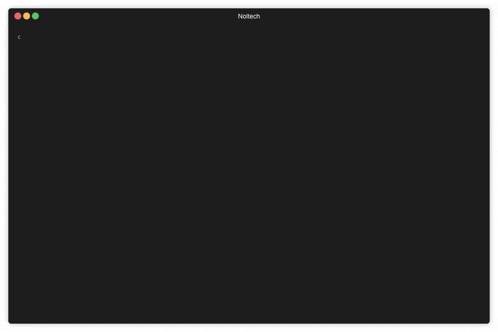

# djpro-nowplaying

Creates a Now_Playing.txt of the tracks you are playing on DJ Pro 2




## Features

- Written in python 
- Easy to install - just use the [install script](https://github.com/geraldnolan/djpro-nowplaying#installation).
- Stupidly [easy to use](https://github.com/geraldnolan/djpro-nowplaying#usage)
- Works on Mac

## Installation

### Step #1 — First of all download the get-pip file by running:

    curl https://bootstrap.pypa.io/get-pip.py -o get-pip.py

### Step #2 — Now run this file to install pip

    python get-pip.py


### Option 1: From source

```bash
$ git clone git@github.com:geraldnolan/djpro-nowplaying.git
$ cd djpro-nowplaying/
$ pip install watchdog
$ python nowplaying.py
```


### Basic usage

```bash
$ python nowplaying.py    # outputs now playing text
```

### With Different Directory

```bash
$ python nowplaying.py /Users/username/Music/djay\ Pro\ 2/djay\ Media\ Library.djayMediaLibrary   
```


## Contributing

#### Bug Reports & Feature Requests

Please use the [issue tracker](hhttps://github.com/geraldnolan/djpro-nowplaying/issues) to report any bugs or file feature requests.

#### Developing

PRs are welcome. To begin developing, do this:

```bash
$ git clone git@github.com:geraldnolan/djpro-nowplaying.git
$ cd nowplaying/
$ 
```

#### `install.sh`

This is a handy script that automates a install pip and installs watch dog dependency.

```bash
USAGE:
    $ chmod +x install.sh 
    $ ./install.sh

```